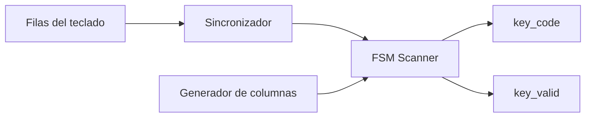
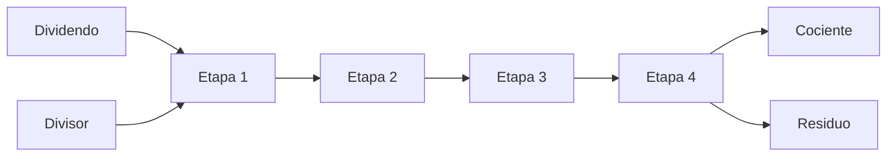
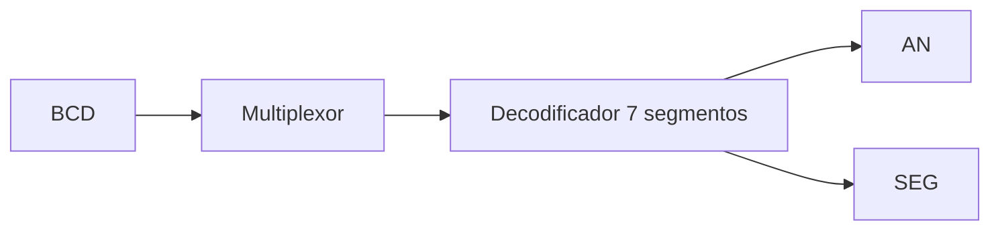
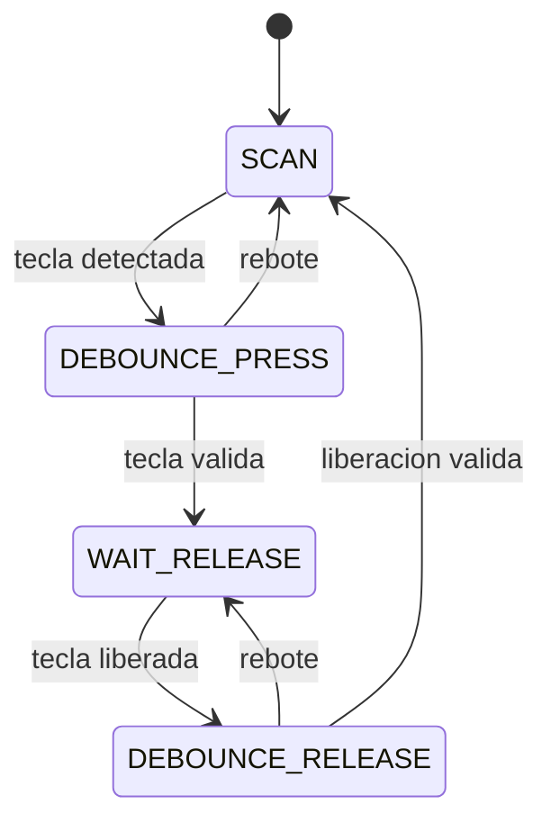
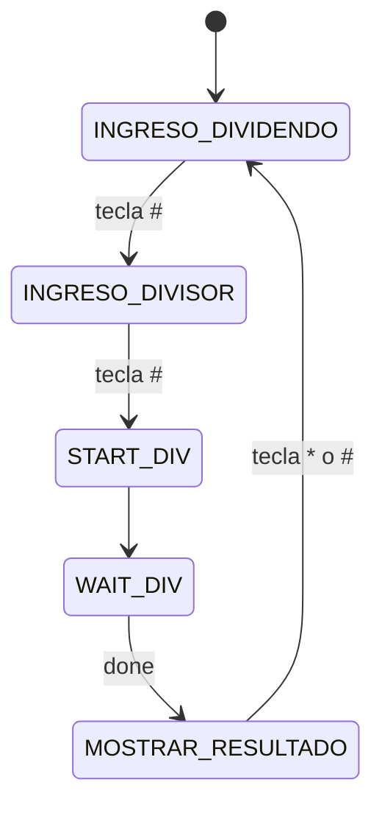

# Nombre del proyecto
División de enteros en FPGA con Teclado Matricial y Display de 7 Segmentos

## 1. Abreviaturas y definiciones
- FPGA: Field Programmable Gate Array.
- FSM: Finite State Machine (Máquina de Estados Finita).
- BCD: Binary Coded Decimal.
- DUT: Device Under Test.
- P&R: Place and Route.
- VCD: Value Change Dump.
- Debounce: Técnica utilizada para eliminar rebotes mecánicos en señales digitales.

## 2. Referencias
[0] David Harris y Sarah Harris. Digital Design and Computer Architecture. RISC-V Edition. Morgan Kaufmann, 2022. ISBN: 978-0-12-820064-3
[1] P. P. Chu. FPGA Prototyping by SystemVerilog Examples. Xilinx MicroBlaze MCS SoC Edition, 2nd ed. Hoboken, NJ, USA: Wiley, 2018

[2] Documentación oficial Tang Nano 9K – Sipeed.

[3] Documentación Yosys Open Synthesis Suite.

[4] Documentación nextpnr-gowin.

## 3. Desarrollo
### 3.1. Descripción general

El sistema implementa una unidad de división entera sin signo sobre una FPGA Tang Nano 9K. El usuario introduce un dividendo y un divisor mediante un teclado hexadecimal matricial 4×4. Una vez ingresados ambos operandos, el sistema ejecuta una división entera utilizando un algoritmo restaurador segmentado mediante pipeline. Finalmente, el cociente o el residuo son desplegados en un display multiplexado de 7 segmentos.

El sistema completo se encuentra dividido en cuatro subsistemas principales:

1. Subsistema de lectura de datos.
2. Subsistema de control.
3. Subsistema de cálculo de división.
4. Subsistema de despliegue.

---

### 3.2. Subsistema de lectura de datos

Este subsistema está implementado mediante el módulo `keypad_scanner`.

Su función consiste en:

* Escanear continuamente las columnas del teclado matricial.
* Detectar la fila activa.
* Decodificar la tecla presionada.
* Eliminar rebotes mecánicos mediante antirrebote por temporización.
* Generar un pulso de validación (`key_valid`) cuando una tecla ha sido confirmada.

Las entradas externas son sincronizadas mediante dos flip-flops consecutivos para evitar problemas de metaestabilidad.

Las teclas especiales utilizadas son:

| Tecla | Función                           |
| ----- | --------------------------------- |
| * (E) | Borrar datos                      |
| # (F) | Confirmar ingreso                 |
| A     | Alternar entre cociente y residuo |

---

### 3.3. Subsistema de control

El módulo principal `top.sv` implementa una máquina de estados finitos encargada de coordinar el funcionamiento global del sistema.

Este bloque:

* Recibe los códigos del teclado.
* Almacena los dígitos del dividendo y divisor.
* Convierte los operandos de BCD a binario.
* Activa el inicio de la división.
* Espera la finalización del cálculo.
* Selecciona si se despliega el cociente o el residuo.

---

### 3.4. Subsistema de cálculo de división

La división es realizada por el módulo `divider_pipelined`.

El algoritmo implementado corresponde a una versión pipelineada del algoritmo restaurador de división binaria.

Características:

* Dividendo de 7 bits.
* Divisor de 5 bits.
* Cociente de 7 bits.
* Residuo de 5 bits.
* Latencia total de 4 ciclos de reloj.

El divisor se divide en cuatro etapas pipeline:

| Etapa   | Filas procesadas |
| ------- | ---------------- |
| Etapa 1 | i=6, i=5         |
| Etapa 2 | i=4, i=3         |
| Etapa 3 | i=2, i=1         |
| Etapa 4 | i=0              |

Cada etapa realiza:

1. Desplazamiento del residuo parcial.
2. Resta del divisor.
3. Evaluación del signo.
4. Restauración cuando la resta resulta negativa.
5. Generación de un nuevo bit del cociente.

El resultado final se entrega mediante las señales:

* `Q` → cociente.
* `R` → residuo.
* `done` → resultado válido.

---

### 3.5. Subsistema de despliegue

El módulo `seven_seg_display` controla cuatro displays de siete segmentos mediante multiplexación temporal.

Este bloque:

* Refresca continuamente los displays.
* Selecciona un dígito activo por ciclo de multiplexación.
* Convierte números BCD a patrones de siete segmentos.
* Permite apagar dígitos mediante la máscara `en_mask`.

Cuando la división finaliza:

* Se muestra el cociente precedido por la letra C.
* Se muestra el residuo precedido por la letra d.

La selección se realiza mediante la tecla A.

---

## 4. Diagramas de bloques de cada subsistema

### 4.1. Sistema completo
```mermaid
4_filas/rely/reset --> keypad_scanner --> key_code --> TOP
                                      --> key_valid --> TOP
                                                        TOP --> valid --> divider_pipelined --> done --> TOP
                                                                                            --> Q/R  --> TOP
                                                        TOP --> D/en_mask --> 7_seg_display --> seg_7/AN --> Display físico
```
---

### 4.2. Subsistema de lectura



---

### 4.3. Subsistema de división



---

### 4.4. Subsistema de despliegue



---

## 5. Diagramas de estado de las FSM

### 5.1. FSM del teclado



---

### 5.2. FSM principal del sistema



---

## 6. Ejemplo y análisis de una simulación funcional

### 6.1. Caso de prueba

Dividendo = 127

Divisor = 31

Operación realizada:

127 ÷ 31

Resultado esperado:

* Cociente = 4
* Residuo = 3

---

### 6.2. Flujo de ejecución

#### 6.2.1. Paso 1 – Ingreso del dividendo

El usuario ingresa:

1 → 2 → 7

La FSM permanece en el estado:

```
INGRESO_DIVIDENDO
```

y almacena los tres dígitos.

---

#### 6.2.2. Paso 2 – Confirmación

El usuario presiona:

```
#
```

La FSM cambia a:

```
INGRESO_DIVISOR
```

---

#### 6.2.3. Paso 3 – Ingreso del divisor

El usuario introduce:

```
3 → 1
```

---

#### 6.2.4. Paso 4 – Inicio de la división

Se vuelve a presionar:

```
#
```

La FSM genera:

```
div_valid = 1
```

durante un ciclo de reloj.

---

#### 6.2.5. Paso 5 – Procesamiento pipeline

La operación avanza por las cuatro etapas pipeline:

1. Etapa 1 genera dos bits del cociente.
2. Etapa 2 genera dos bits adicionales.
3. Etapa 3 genera otros dos bits.
4. Etapa 4 genera el último bit y el residuo.

Después de cuatro ciclos:

```
done = 1
```

---

#### 6.2.6. Paso 6 – Visualización

El sistema entra en:

```
MOSTRAR_RESULTADO
```

y despliega:

```
C004
```

indicando cociente igual a 4.

Al presionar la tecla A:

```
d003
```

indicando residuo igual a 3.

---

### 6.3. Verificación funcional

El testbench `tb_primera_fila.sv` valida exhaustivamente la primera fila del algoritmo restaurador.

Las pruebas realizadas incluyen:

* Casos normales.
* Casos límite.
* Barridos completos para B = 0..31.
* Validación automática contra un modelo de referencia.

Los resultados obtenidos muestran cero errores para todos los casos probados, verificando el funcionamiento correcto de la primera etapa del divisor. Esto se evidencia en la imagen donde se entrega el resultado del comando 'make test':


Para el testbench `tb_pipeline.sv` más bien se encarga de verificar que el pipeline creado sí funcione de manera correcta.

Para ello se probó que:
* Para diferentes valores de dividendos y divisores, se realice la división efectivamente.
* Entregar valores de cociente y residuo.
* Funcionamiento correcto, no se mezclan datos y se entregan los datos según se piden.
* Verifica latencia de 4 ciclos.
* Se hace reset de los valores.

La prueba no presentó errores en ninguna de las pruebas, por lo que se puede afirmar que el sistema está funcionando correctamente, y esto se puede observar en la siguiente imagen:


## 7. Archivo de Constraints
El archivo pines.cst define la asignación física de pines de la FPGA Tang Nano 9K.

Las señales asignadas incluyen:

reloj principal,
reset,
filas del teclado,
columnas del teclado,
segmentos del display,
ánodos de displays.

También se configuraron resistencias pull-down en las entradas del teclado para evitar estados flotantes.

## 8. Problemas Encontrados Durante el Proyecto
Durante el desarrollo del proyecto se encontraron varios problemas técnicos importantes:

Rebotes mecánicos del teclado matricial.
Problemas de sincronización en señales asíncronas.
Ajuste de tiempos de debounce.
Multiplexación incorrecta de displays.
Manejo de acarreos decimales.
Compatibilidad de SystemVerilog con Yosys.
Ajuste de tiempos de simulación.
Control de displays activos en alto.
Verificación de overflow.
Integración entre módulos.

Todos los problemas fueron corregidos satisfactoriamente.

## 9. Consumo de Recursos
El diseño final fue sintetizado exitosamente para la FPGA Tang Nano 9K. Hubo un consumo de 6%.

La implementación cumplió correctamente con:

frecuencia objetivo de 27 MHz,
utilización válida de LUTs,
utilización válida de flip-flops,
sincronización correcta,
generación correcta del bitstream final.

Imagen evidenciando el consumo total de los recursos:


## 10. Reporte de velocidades
Realizando el comando "make pnr" se obtuvo que la velocidad máxima que alcanzó el diseño propuesto fue de aproximadamente 62.72MHz, lo cual cumple con el objetivo de una velocidad mínima de 27MHz. Haciendo el cálculo de los tiempos, el objetivo era que no durara más de 37.04ns (según los 27MHz), y esto se logra puesto que al realizar el mismo cálculo, el tiempo es de 14.76ns, por lo que se adapta a la restricción temporal.
Esto anterior se evidencia en la siguiente imagen:


# 11. Conclusiones
Se logró implementar correctamente una calculadora decimal completamente funcional utilizando FPGA y SystemVerilog.

El sistema permitió capturar datos desde un teclado hexadecimal matricial, procesar operaciones aritméticas y desplegar resultados utilizando displays de siete segmentos multiplexados.

Además, el proyecto permitió aplicar conceptos fundamentales de diseño digital como:

máquinas de estados,
sincronización,
multiplexación,
debounce,
diseño síncrono,
simulación funcional,
síntesis lógica.

Finalmente, todas las pruebas realizadas tanto en simulación como en síntesis fueron exitosas, validando el funcionamiento correcto del sistema completo.

## 12. Apéndices

### 12.1 Apéndice A – Herramientas utilizadas
SystemVerilog
Yosys
nextpnr-gowin
gowin_pack
GTKWave
Icarus Verilog
openFPGALoader

### 12.2 Apéndice B – FPGA utilizada
Tang Nano 9K
Gowin GW1NR-LV9QN88PC6/I5
