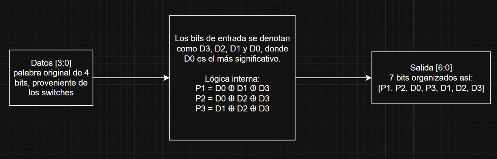
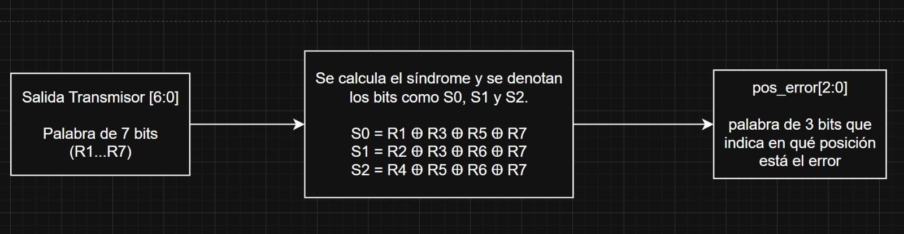
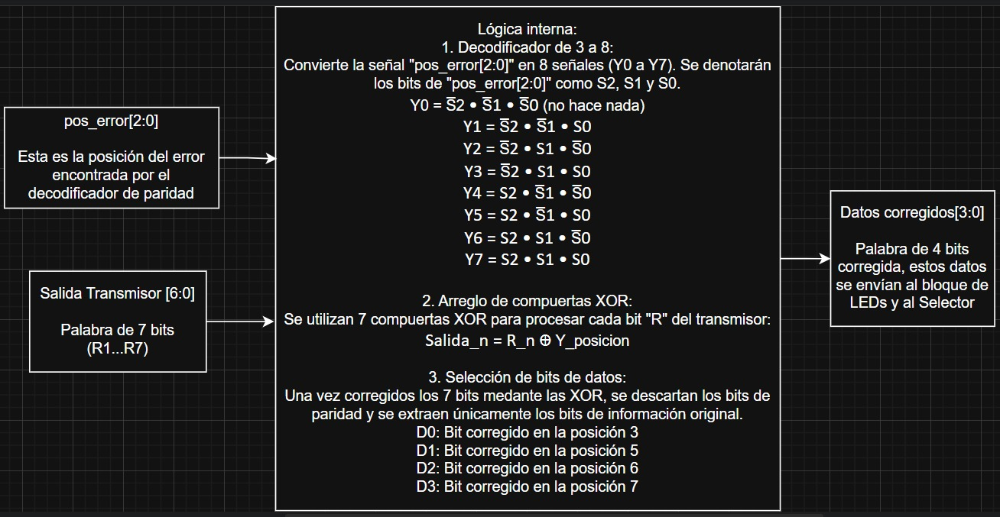
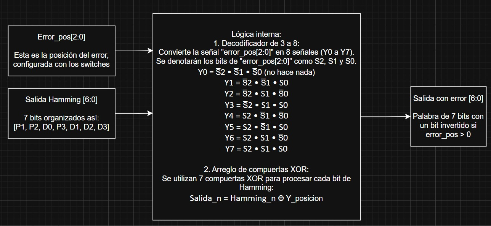
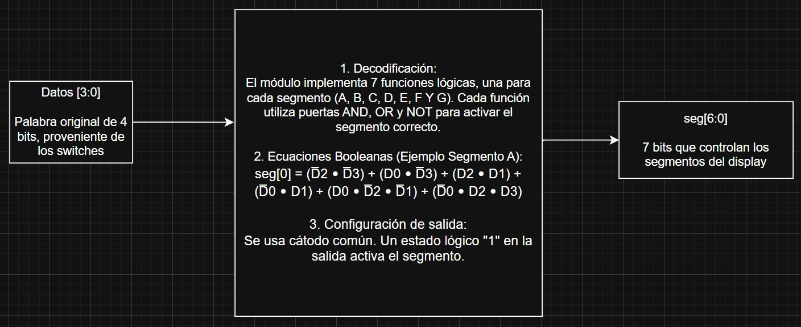

# Proyecto corto I: Diseño digital combinacional en dispositivos programables

## 1. Abreviaturas y definiciones
- **FPGA**: Field Programmable Gate Arrays

## 2. Referencias
[0] David Harris y Sarah Harris. *Digital Design and Computer Architecture. RISC-V Edition.* Morgan Kaufmann, 2022. ISBN: 978-0-12-820064-3

[1] David Medina. Video tutorial para principiantes. Flujo abierto para TangNano 9k. Jul. de 2024. url:
https://www.youtube.com/watch?v=AKO-SaOM7BA.

[2] David Medina. Wiki tutorial sobre el uso de la TangNano 9k y el flujo abierto de herramientas. Mayo de
2024. url: https://github.com/DJosueMM/open_source_fpga_environment/wiki

[4] razavi b. (2013) fundamentals of microelectronics. segunda edición. john wiley & sons

## 3. Desarrollo

### 3.0 Descripción general del sistema

El circuito incluye un sistema digital de trasmisión y recepción de datos con detección y correción de un error. Se basa en el código Hamming (7, 4).

1) Codificador Hamming (7,4)
Se agrega una palabra de datos de 4 bits como entrada [D3, D2, D1, D0].
Se calculan tres bits de paridad (P3, P2, P1) utilizando compuertas XOR. Se organiza la información en una palabra de 7 bits en formato [D3, D2, D1, P3, D0, P2, P1].

2) Inyector de Error
Entran la palabra de 7 bits que viene del codificador y la posición del error.
Con un decoder de 3 a 8, el sistema identifica la posición seleccionada y aplica una operación XOR sobre el bit correspondiente. Si la entrada es 000, no se altera la palabra, cualquier otra combinación invierte el bit en dicha posición.
La salida es una palabra de 7 bits con o sin error.

3) Decodificador de Paridad
Recibe la palabra de 7 bits que sale del transmisor.
El módulo recalcula las paridades de la palabra recibida. Se genera un vector de 3 bits que indica la posición del error.
Si el vector es 000, la palabra es correcta, de lo contrario, indica la posición del error.

4) Corrector de Error
A este módulo le entra el vector de la posición de error y la palabra de 7 bits que sale del transmisor.
Se encarga de invertir el bit de la posición especificada. Luego, descarta los 3 bits de paridad y envía los 4 bits de datos ya corregidos.

5) Codificación bin a 7 seg.
Entra la palabra de 4 bits y se encarga de implementar las ecuaciones booleanas simplificadas mediante mapas K para activar los segmentos necesarios.

6) Despliegue en LEDs
Entra la palabra corregida de 4 bits.
Enciende los LEDs correspondientes dependiendo de la palabra corregida. Si la palabra es 0000, todos los LEDs estarán apagados.

### 3.2 Diagramas de bloques de cada subsistema

**Subsistema 1:** 

**Subsistema 2:** 

**Subsistema 3:** 

**Subsistema 4:** 

**Subsistema 5:** 
