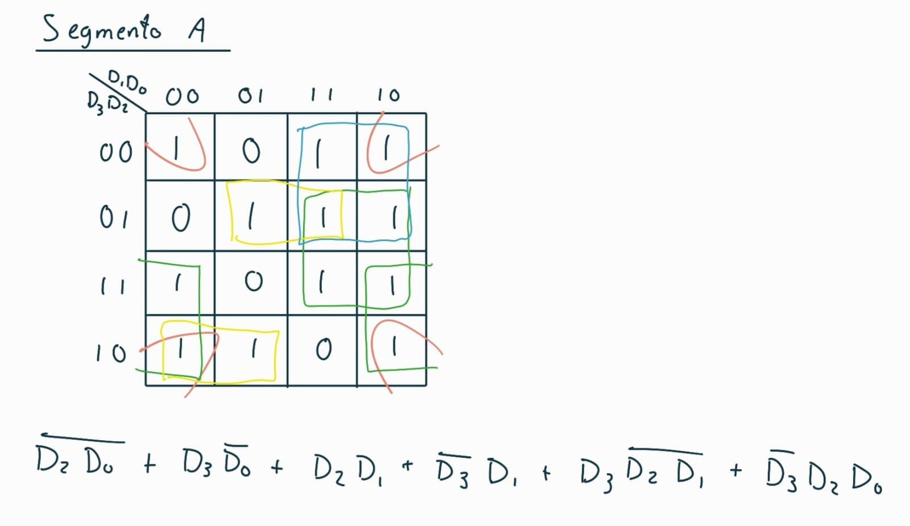
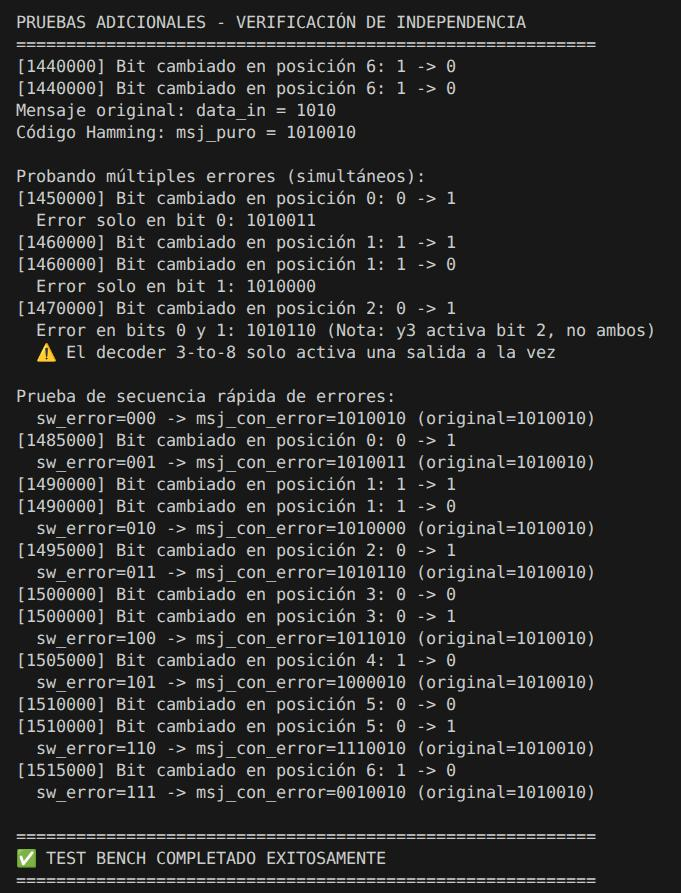

# Proyecto corto I: Diseño digital combinacional en dispositivos programables

## 1. Descripción general del sistema

El circuito incluye un sistema digital de trasmisión y recepción de datos con detección y correción de un error. Se basa en el código Hamming (7, 4).

1) Codificador Hamming (7,4)
Se agrega una palabra de datos de 4 bits como entrada [D3, D2, D1, D0].
Se calculan tres bits de paridad (P3, P2, P1) utilizando compuertas XOR. Se organiza la información en una palabra de 7 bits en formato [D3, D2, D1, P3, D0, P2, P1].

2) Inyector de Error
Entran la palabra de 7 bits que viene del codificador y la posición del error.
Con un decoder de 3 a 8, el sistema identifica la posición seleccionada y aplica una operación XOR sobre el bit correspondiente. Si la entrada es 000, no se altera la palabra, cualquier otra combinación invierte el bit en dicha posición.
La salida es una palabra de 7 bits con o sin error.

3) Decodificador de Paridad
Recibe la palabra de 7 bits que sale del transmisor.
El módulo recalcula las paridades de la palabra recibida. Se genera un vector de 3 bits que indica la posición del error.
Si el vector es 000, la palabra es correcta, de lo contrario, indica la posición del error.

4) Corrector de Error
A este módulo le entra el vector de la posición de error y la palabra de 7 bits que sale del transmisor.
Se encarga de invertir el bit de la posición especificada. Luego, descarta los 3 bits de paridad y envía los 4 bits de datos ya corregidos.

5) Codificación bin a 7 seg.
Entra la palabra de 4 bits y se encarga de implementar las ecuaciones booleanas simplificadas mediante mapas K para activar los segmentos necesarios.

6) Despliegue en LEDs
Entra la palabra corregida de 4 bits.
Enciende los LEDs correspondientes dependiendo de la palabra corregida. Si la palabra es 0000, todos los LEDs estarán apagados.

## 2. Diagramas de bloques de cada subsistema

**Subsistema 1:** 

**Subsistema 2:** 

**Subsistema 3:** 

**Subsistema 4:** 

**Subsistema 5:** 

## 3. Ejemplo de Simplificación del Circuito Corrector

La lógica del corrector se basa un un decodificador de 3 a 8 que activa la inversión del bit correspondiente.
Un ejemplo de la simplificación booleana para la corrección del Bit 7 (D3) se presenta a continuación:
$$Y_7 = S_2 \cdot S_1 \cdot S_0$$
Donde $Y_7$ es la señal que activa la compuerta XOR encargada de corregir el bit en la posición 7 cuando se detecta una falla.

## 4. Ejemplo de Simplificación del Decodificador de 7 Segmentos

A partir de los Mapas K diseñados, se simplificaron las ecuaciones para cada segmento. Para el **Segmento A**, la ecuación es:
$$A = (\overline{D_2} \cdot \overline{D_0}) + (D_3 \cdot \overline{D_0}) + (D_2 \cdot D_1) + (\overline{D_3} \cdot D_1) + (D_3 \cdot \overline{D_2} \cdot \overline{D_1}) + (\overline{D_3} \cdot D_2 \cdot D_0)$$

## 5. Ejemplo y Análisis de Simulación

En la simulación se lograron obtener los resultados deseados. Se logra pasar un mensaje de 4 bits a su código de Hamming respectivo. Además, se lograron crear diferentes casos donde se inyecta un error en distintas posiciones del código Hamming creado, generando el código con un error donde uno desee.

## 6. Análisis de consumo de recursos en la FPGA

El sistema tiene una alta eficiencia. Al ser un diseño combinacional, el uso de LUTs es mínimo y se limita a la implementación de ecuaciones de Hamming y decodificadores. Se prioriza el uso de pines físicos para interconectar las placas.
El consumo energético es muy bajo. Esto se debe a que los procesos son muy sencillos y no se opera con frecuencias elevadas.

## 7. Errores y Problemas encontrados
Hubo poco conocimiento previo del lenguaje de programación para FPGA.
Durante las pruebas, algunos segmentos no encendían correctamente, lo que se debió a una mala asignación de pines en el archivo de constraints o a conexiones incorrectas en la protoboard.
Aunque el código estaba correcto, la relación entre cada bit de salida y el segmento físico no coincidía inicialmente, lo que generó resultados visuales incorrectos.
Debido a la combinación de hardware (FPGA + protoboard) y software (Verilog), fue necesario invertir más tiempo en pruebas y correcciones para lograr el funcionamiento completo del sistema.

## 8. Bitácoras
- Noah Gutierrez Valerin:

## 9. Abreviaturas y definiciones
- **FPGA**: Field Programmable Gate Arrays

## 10. Referencias
[0] David Harris y Sarah Harris. *Digital Design and Computer Architecture. RISC-V Edition.* Morgan Kaufmann, 2022. ISBN: 978-0-12-820064-3

[1] David Medina. Video tutorial para principiantes. Flujo abierto para TangNano 9k. Jul. de 2024. url:
https://www.youtube.com/watch?v=AKO-SaOM7BA.

[2] David Medina. Wiki tutorial sobre el uso de la TangNano 9k y el flujo abierto de herramientas. Mayo de
2024. url: https://github.com/DJosueMM/open_source_fpga_environment/wiki

[4] razavi b. (2013) fundamentals of microelectronics. segunda edición. john wiley & sons
