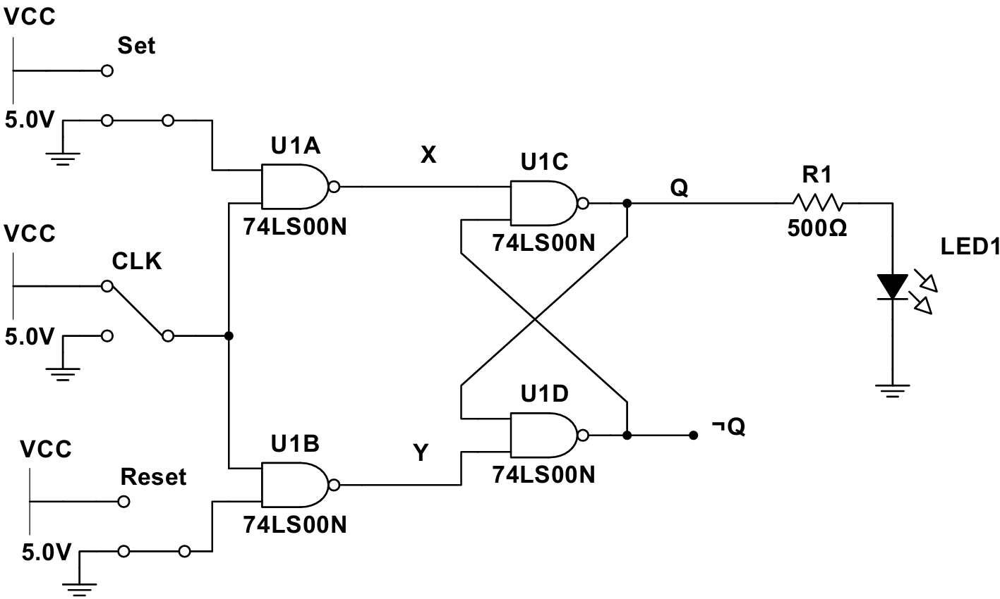
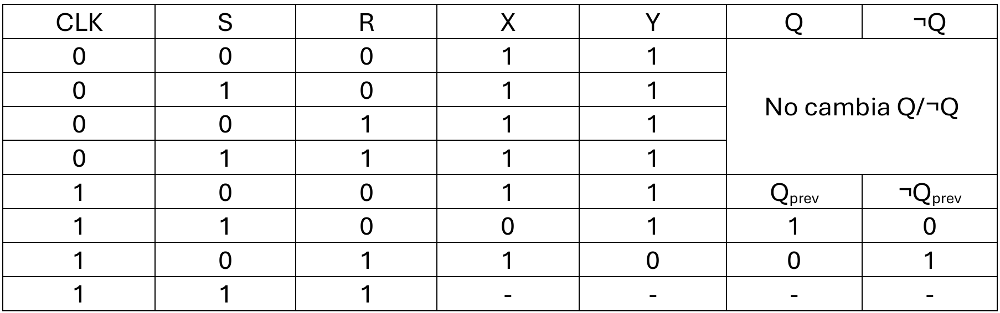
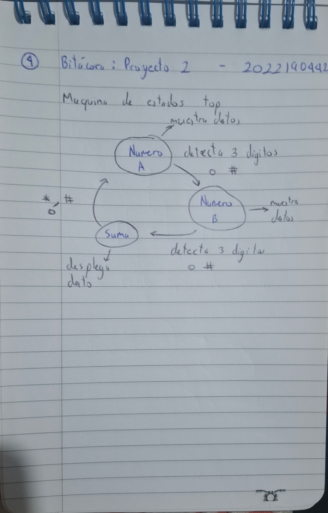
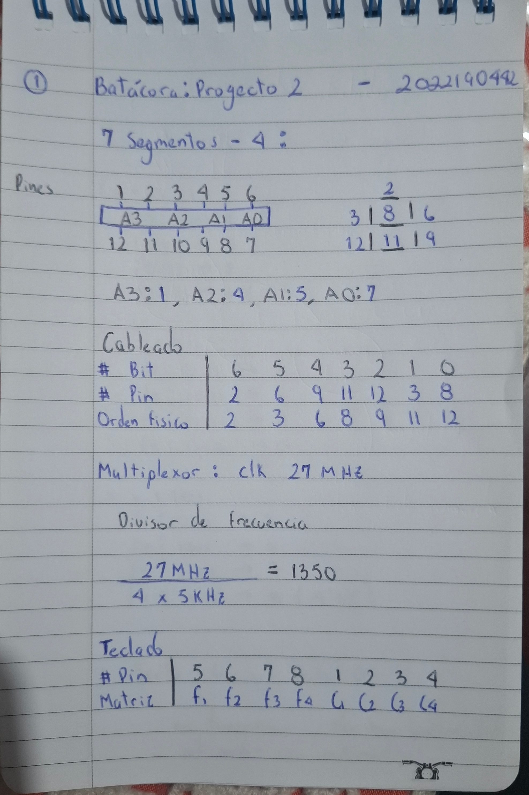
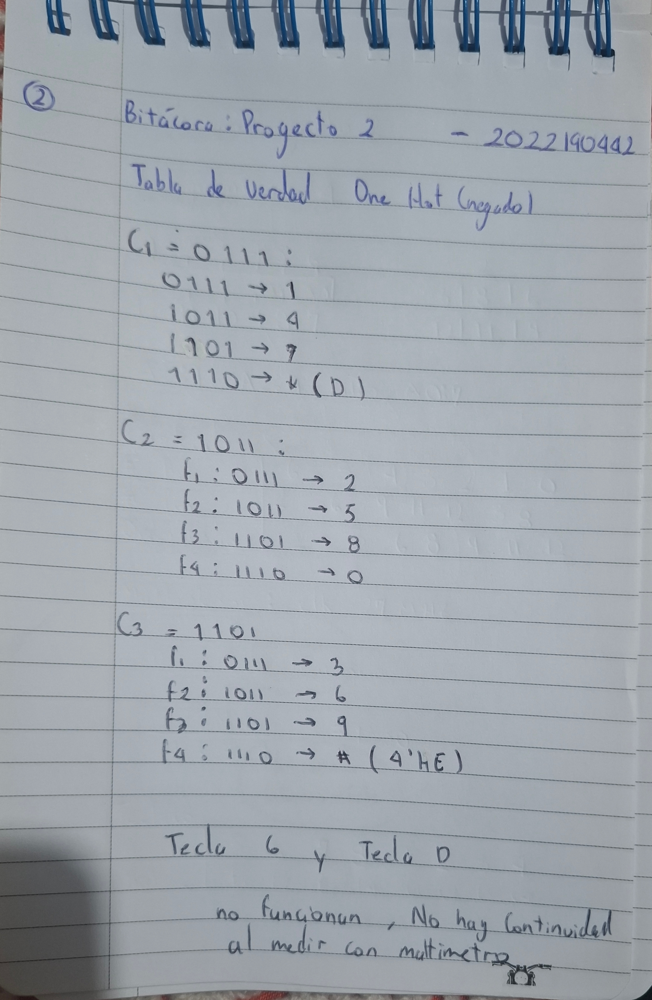
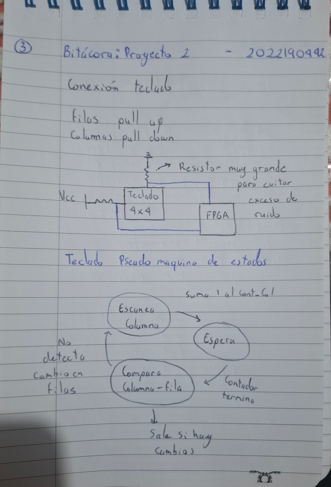

# Proyecto 2

## 1. Abreviaturas y definiciones
- **FPGA**: Field Programmable Gate Arrays

## 2. Referencias
[0] David Harris y Sarah Harris. *Digital Design and Computer Architecture. RISC-V Edition.* Morgan Kaufmann, 2022. ISBN: 978-0-12-820064-3

[1] David Medina. Video tutorial para principiantes. Flujo abierto para TangNano 9k. Jul. de 2024. url: https://www.youtube.com/watch?v=AKO-SaOM7BA.

[2] David Medina. Wiki tutorial sobre el uso de la TangNano 9k y el flujo abierto de herramientas. Mayo de 2024. url: https://github.com/DJosueMM/open_source_fpga_environment/wiki

[4] razavi b. (2013) fundamentals of microelectronics. segunda edición. john wiley & sons

## 3. Introduccion 

### 3.1 Resumen 

En este proyecto se desarrolló e implementó en FPGA un sistema digital capaz de realizar la suma de dos números expresados en formato BCD (Binary Coded Decimal), ingresados de manera externa, y mostrar el resultado final en un conjunto de cuatro displays de 7 segmentos. El diseño se estructuró en módulos jerárquicos que permiten la conversión de BCD a binario, la suma aritmética y la conversión de binario nuevamente a BCD para su visualización.
Para verificar su correcto funcionamiento, se diseñaron bancos de prueba (testbench) en SystemVerilog, y se utilizó un flujo de trabajo basado en herramientas libres como Yosys, Icarus Verilog, NextPNR, GTKWave y OpenFPGALoader. De esta forma, se pudo simular, sintetizar y cargar el diseño en una FPGA TangNano9K de Gowin.

### 3.2 Definición del problema

El problema a resolver consiste en implementar un circuito digital en FPGA que permita sumar dos números decimales de hasta tres dígitos, ingresados mediante un teclado hexadecimal. Estos valores deben ser capturados de forma sincronizada, eliminando rebotes y posibles errores mecánicos. Posteriormente, el sistema debe convertir los dígitos BCD a binario, realizar la suma, y convertir el resultado nuevamente a BCD para desplegarlo en cuatro displays de 7 segmentos.
Este proceso debe realizarse de manera confiable, sincronizada con la señal de reloj de la FPGA, y garantizando que el resultado final se muestre correctamente en todo momento.

### 3.3 Objetivos 

El objetivo general es diseñar, simular e implementar en FPGA un sistema digital que realice la suma de dos números BCD de tres dígitos y despliegue el resultado en displays de 7 segmentos.

Los objetivos especificos son;
Desarrollar módulos independientes para la conversión de BCD a binario y de binario a BCD.

Implementar un módulo sumador que opere con números binarios de 11 bits para cubrir el rango máximo posible (999 + 999 = 1998).

Diseñar un banco de pruebas para validar el funcionamiento lógico del sistema en simulación antes de su implementación física.

Utilizar un flujo de trabajo automatizado mediante Makefile para sintetizar, colocar y enrutar, generar el bitstream y cargarlo en la FPGA.

Asegurar una correcta sincronización de las señales de entrada y eliminar problemas de rebote o ruido en la captura de datos.

Visualizar correctamente los resultados de la suma en cuatro displays de 7 segmentos.

### Especificaciones 

Se tienen las siguientes especificaciones planteadas en el enunciado;

-lataforma de desarrollo: FPGA TangNano 9K (Gowin).

-Lenguaje de descripción: SystemVerilog.

-Cantidad de dígitos de entrada: 3 dígitos por número (máximo 999).

-Formato de entrada: BCD (Binary Coded Decimal).

-Rango de suma: 000 + 000 hasta 999 + 999 = 1998.

-Visualización: 4 dígitos en displays de 7 segmentos.

-Frecuencia de reloj: 100 MHz (clk generado internamente).

-Módulos principales:

-Conversor BCD a binario.

-Sumador binario de 11 bits.

-Conversor binario a BCD (4 dígitos).

-Módulo top jerárquico.

-Verificación: Simulación con Icarus Verilog y GTKWave.

-Implementación física: Carga en FPGA mediante OpenFPGALoader

## 4 Desarrollo 

El circuito completo implementa un sumador decimal de tres dígitos, el cual recibe dos números en formato BCD (Binary Coded Decimal), los convierte a binario para realizar la operación aritmética, y posteriormente convierte el resultado a BCD para visualizarlo en cuatro displays de 7 segmentos.
El sistema opera de manera sincrónica, utilizando una señal de reloj generada por la FPGA. Los datos de entrada son capturados de forma controlada mediante una señal de carga (load), y la operación de conversión y suma se inicia mediante una señal de control (start_conv). Cuando el proceso se completa, se activa la señal de ready, indicando que el resultado está listo para visualizarse.
Para efectos de simulación, se utiliza un testbench que aplica distintos valores de entrada, genera el reloj y comprueba el resultado de la operación. Para la implementación física, los valores provendrían de un teclado hexadecimal, con un circuito eliminador de rebotes para asegurar que las entradas se registren correctamente.

Descripción por Subsistemas;

Subsistema de Lectura de Teclado Hexadecimal

Función Principal: Capturar, desrebotar y sincronizar dos números decimales de tres dígitos desde un teclado mecánico hexadecimal.

Funcionamiento Detallado:

Captura de Teclas: Implementa un barrido secuencial de columnas y monitoreo de filas para detectar teclas presionadas
. Eliminación de Rebote: Utiliza un circuito digital o FSM para filtrar transitorios mecánicos (≈20-50 ms)
. Sincronización: Registra las señales asíncronas del teclado con el reloj de 27 MHz de la FPGA
. Formato de Entrada: Permite ingreso similar a calculadora tradicional, con visualización progresiva en 7 segmentos
. Control por FSM: Gestiona la transición entre entrada del primer número, segundo número y ejecución de la suma
.Flujo de Datos: Teclado,Sincronización Desrebote, Decodificación, Almacenamiento en registros

Subsistema de Suma Aritmética

Función Principal: Realizar la operación de adición de los dos números capturados.

Funcionamiento Detallado:

Conversión BCD a Binario: Transforma los dígitos BCD individuales a valores binarios completos
. centenas × 100 + decenas × 10 + unidades
. Operación de Suma: Ejecuta la adición aritmética de los dos valores binarios
. Manejo de Acarreo: Gestiona overflow para números de hasta 1998 (999+999)
. Pipeline Síncrono: Todos los cálculos se registran en flancos de reloj para mantener sincronización
. Flujo de Datos: BCD → Conversión Binaria → Suma → Resultado Binario

Subsistema de Despliegue en 7 Segmentos

Función Principal: Convertir el resultado binario a formato BCD y mostrarlo en cuatro displays de 7 segmentos.

uncionamiento Detallado:

.Conversión Binario-BCD: Implementa algoritmo "Double Dabble" para convertir el resultado binario a 4 dígitos BCD
.Multiplexación Temporal: Alterna rápidamente entre los cuatro displays usando refresco por persistencia retinal
.Decodificación 7-Segmentos: Convierte dígitos BCD a los patrones de segmentos correspondientes
.Control de Ánodos/Cátodos: Gestiona la configuración de cátodos comunes con ánodos multiplexados

### Diagramas de bloques 

Subsistema 1 (modulo_1) ; Convierte los tres dígitos BCD introducidos (d2, d1, d0) a un valor binario entero, que se usa para la operación aritmética posterior.

Subsitema 2 (modulo_2) ; Realiza la suma aritmética directa de los dos operandos convertidos desde BCD.

Subsistema 3 (modulo_3) ; Convierte un número binario (resultado de la suma) a formato BCD, para poder mostrarlo en los displays de 7 segmentos.

Subsistema 4 (lector_teclado ; Escanea continuamente el teclado matricial hexadecimal y detecta qué tecla fue presionada, aplicando eliminación de rebote para evitar lecturas falsas.

Subsistema 5 (display_mux) ; Controla cuatro displays de 7 segmentos compartiendo las líneas de segmentos, activando un dígito a la vez de forma secuencial (multiplexado dinámico).

Subsitema 6 (top_adder) ; Integra las tres etapas principales

Subsistema 7 (modulo_top_sumador) ; Es el módulo principal del proyecto, que interconecta todos los subsistemas:

------------------------------------------------------------------------------------------------------------------------------------

### Diagramas de estado

FSM del Control Principal

FSM del Lector de Teclado

FSM del Control de Displays

------------------------------------------------------------------------------------------------------------------------------------

## 5. Testbench

Para validar el funcionamiento lógico del sistema sumador BCD implementado en FPGA, se desarrolló un testbench en SystemVerilog que permite simular el comportamiento completo del circuito antes de su síntesis física.

La simulación tiene como objetivo comprobar que la arquitectura compuesta por los módulos de conversión, suma y reconversión a BCD funcione correctamente bajo distintas condiciones de entrada.

El testbench genera un reloj de 100 MHz y una secuencia de señales de control que simulan el comportamiento esperado del hardware real. Inicialmente se realiza un reset del sistema, luego se cargan los datos de entrada mediante la señal load, y posteriormente se inicia la conversión y suma a través de la señal start_conv.

Durante la ejecución, se aplican tres casos de prueba representativos:

Caso 1: 123 + 456 → resultado esperado: 579

Caso 2: 999 + 999 → resultado esperado: 1998

Caso 3: 007 + 015 → resultado esperado: 022

Cada prueba se ejecuta de forma automática mediante la tarea do_test, que controla las entradas, sincroniza los flancos del reloj y espera la activación de la señal ready antes de mostrar el resultado.

La simulación genera además un archivo de ondas (tb_modulo_sumador_top.vcd) que puede visualizarse en GTKWave, lo que permite observar gráficamente el comportamiento temporal de las señales internas: reloj, reset, señales de carga, conversión, sumas y salidas en formato BCD.

------------------------------------------------------------------------------------------------------------------------------------

------------------------------------------------------------------------------------------------------------------------------------

-----------------------------------------------------------------------------------------------------------------------------------

------------------------------------------------------------------------------------------------------------------------------------

------------------------------------------------------------------------------------------------------------------------------------

La simulación permitió verificar la integración entre los distintos módulos del proyecto dentro del entorno de desarrollo OSS-Cad-Suite.
A través del testbench se validó la generación de reloj, el control de señales y la secuencia de ejecución del sistema sumador.
Los resultados obtenidos demuestran que el flujo de trabajo —desde la compilación automática con Makefile hasta la generación del archivo .vcd— funciona correctamente, garantizando una base sólida para la posterior depuración y validación funcional de los módulos de conversión y suma.

## 8. Consumo de recursos

El diseño del sumador BCD implementado en la FPGA TangNano 9K consume 415 celdas lógicas, demostrando una eficiente utilización de recursos. La distribución muestra un balance saludable entre elementos combinacionales y secuenciales: 115 ALUs para operaciones aritméticas, 51 flip-flops (DFF) para el almacenamiento de estados, y 202 LUTs distribuidas desde 1 a 6 entradas para la lógica combinacional. El uso predominante de LUTs de 4 y 5 entradas indica una complejidad moderada en las funciones implementadas, típica de algoritmos de conversión numérica como el Double Dabble. La ausencia de memorias RAM y el bajo consumo de recursos general sugiere un diseño optimizado que dejaría amplio margen para implementar funcionalidades adicionales como el control del teclado y multiplexación de displays en el sistema completo. 

------------------------------------------------------------------------------------------------------------------------------------

------------------------------------------------------------------------------------------------------------------------------------

## 9. Reporte de velocidades máximas

La FPGA Tang Nano 9K opera con un reloj base de 27 MHz, por lo que el diseño cumple ampliamente las restricciones de tiempo, garantizando una operación confiable sin violaciones de temporización.

## 10. Problemas encontrados durante el proyecto

- Problema con el registro que guarda las teclas. Posible solución, utilizar un contador mas lento para el guardado de los datos funcionando de forma asincrona.

## 11. Contadores sincrónicos

¿Qué hace la salida RCO en un 74LS163?

  R/ Indica cuando el contador llega a su valor máximo y las señales T y P están en alto.
  
Explique por qué RCO y T están conectadas entre los dos contadores y explique cómo trabaja esta conexión.

  R/ RCO conectado a T funciona como un divisor de frecuencia lógico, cuando el primer 74LS163 completa un ciclo de 16 bits este envía una señal ROC y este pulso habilita al segundo contador. Dividiendo la señal original entre 16.
  
¿Cuál es la diferencia entre las entradas T y P del 74LS163?

  R/ Tanto los pines ENP y ENT funcionan como contadores en alto, pero la diferencia fundamental es que ENP no controla la salida del RCO mientras que ENT es el que habilita la salida del RCO. 
  
¿Cúanto toma, luego del flanco positivo de reloj, para que uno de los flip-flops cambie de estado?

  R/ de 10 - 20 ns
  
¿Importa cuál bit de salida escoja?

  R/ Pese a que todos los bits cambian al mismo tiempo por el flip – flop, hay una diferencia entre la frecuencia de cambio de los bits, por ejemplo Qa cambia a 1/2 de la frecuencia de reloj, mientras que Qd cambia a 1/16 de la frecuencia de reloj.
  
Use la opción de captura de fallas en el osciloscopio a ver si puede localizar alguna falla, Explique en qué casos es esperable hallar esta falla.

  R/ Cuando los flip - flops no cambian al mismo instante, es posible que ocurra cuando el RCO cambia de de alto a bajo y viceversa.

## 12. Cerrojo Set-Reset
Primeramente se dibujo el diagrama del Latch S-R con reloj usando 4 compuertas NAND:

Tambien se dibujo la tabla de verdad del diagrama:

El funcionamiento:

Este Latch S-R, funciona mediante dos etapas, en la primera etapa, las primeras dos compuertas se encargan de recibir las entradas de Set, Reset y Clk del Latch. En la segunda etapa otras dos compuertas NAND se encargan de dar la salida Q de acuerdo las entradas recibidas anteriormente y cruzando las salidas de las mismas. La utilidad de este cerrojo esta en la memoria de un bit y su complemento que produce.

## Bitacoras 
Ismael Isaac Flores Mercado;

Juan Esteban Obando Perez;

